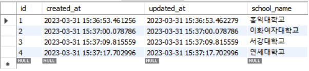
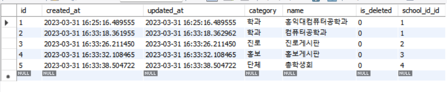
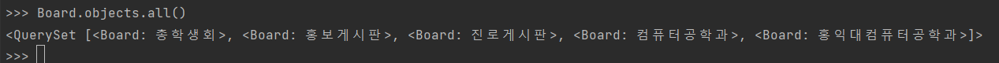
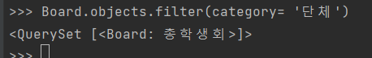

# CEOS 17기 백엔드 스터디

### 에브리타임 서비스 설명 w/ ERD
* 데이터 모델링 분류를 크게 **account**, **board**, **timetable** 세가지로 나누었다.
* account 기능: User, School
    * 사용자는 가입할 때, 학교를 선택하여야 한다.
    * 이후 사용자는 개인 정보(아이디, 비밀번호, 이메일, 닉네임, 입학연도 등)를 입력하여 에브리타임에 가입한다. 
* board 기능(커뮤니티 기능): Board, Post, Message, My_board, Post_media, Comment, Scrap
    * 사용자는 게시판을 즐겨찾기를 통해 고정할 수 있다.
    * 사용자는 게시물을 작성할 수 있으며, 게시물을 스크랩, 공감할 수 있고, 댓글과 대댓글을 작성할 수 있다.
    * 사용자는 스크랩한 게시물을 따로 모아서 볼 수 있다. 
    * 사용자는 게시글을 쓴 사람 혹은 댓글을 단 사람과 쪽지를 주고 받을 수 있다.
* timetable 기능: Friend, Timetable, Lecture, My_lecture, Review
    * 사용자는 강의를 선택하여 시간표에 넣을 수 있다.
    * 사용자는 선택한 강의에 대해 강의평을 작성할 수 있다. 
    * 사용자는 친구맺기 기능을 통해 친구와 시간표를 공유할 수 있다.

### ORM 이용해보기
* ForeignKey 필드를 포함하는 모델로 **Board**을 선택하였다. 
1. 데이터베이스에 해당 모델 객체 3개 이상 넣기
```angular2html
from account.models import School
school1 = School(school_name = '홍익대학교')
school1 = School(school_name = '이화여자대학교')
school1 = School(school_name = '서강대학교')
school1 = School(school_name = '연세대학교')
```

```angular2html
from board.models import Board
board1 = Board(category = '학과', name = '홍익대컴퓨터공학과', school_id_id = 1)
board1 = Board(category = '학과', name = '컴퓨터공학과', school_id_id = 1)
board2 = Board(category = '진로', name = '진로게시판', school_id_id = 2)
board3 = Board(category = '홍보', name = '홍보게시판', school_id_id = 3)
board4 = Board(category = '단체', name = '총학생회', school_id_id = 4)
```

2. 삽입한 객체들을 쿼리셋으로 조회해보기
```angular2html
Board.objects.all()
```

3. filter 함수 사용해보기
```angular2html
Board.objects.filter(category= '단체')
```


### 겪은 오류와 해결 과정
* 메세지에서 두 속성이 같은 유저를 참고할 때 related_name을 설정하라는 오류가 발생했다.
* User 입장에서는 Message에서 두개의 필드가 참조를 하고 있기 때문에 역참조하는 입장에서 생각해봤을 때 이를 구분해달라는 오류인 것 같다고 생각했다.
```angular2html
user = models.ForeignKey(User, on_delete=models.PROTECT)
sender = models.ForeignKey(User, related_name='sender',on_delete=models.PROTECT)
```
related_name 역할?
* User 인스턴스와 연결되어 있는 Message를 거꾸로 불러올 때, related_name='sender' 라는 이름으로 부르겠다고 지정해 준 것이다.
* ralated_name이 필수는 아니지만 위 경우처럼 한 테이블에서 서로 다른 두 속성이 같은 테이블을 참조할  때는 필수로 지정해주어야 한다.

### 새롭게 알게 된점
1. 커스텀 User 모델
* 커스텀 User 모델을 작성하는 세 가지 방법
  *  표준 User 모델과 1대 1 관계를 가지는 모델을 만드는 방법
  * AbstractUser을 상속받는 모델을 만드는 방법
  * AbstractBaseUser을 상속받는 모델을 만드는 방법
* 세가지 중, AbstractBaseUser을 상속받아 구현하였다.
* 커스터마이즈 유연성이 세가지 중 가장 높다.(=최소한의 필드만 제공)
2. 생성시각, 수정시각
```angular2html
class TimestampedModel(models.Model):
    # 생성된 날짜를 기록
    created_at = models.DateTimeField(auto_now_add=True)
    # 수정된 날짜를 기록
    updated_at = models.DateTimeField(auto_now=True)
```
언제 만들어졌고 수정되었는지는 향후 유지보수에 있어서 굉장히 중요한 정보이기 때문에 TimestampedModel 클래스를 따로 만들어 모든 클래스가 이를 상속받도록 하였다.
3. UUID
* 중복되지 않는 ID를 만드는 표준 규약
* 계속해서 생성하여도 중복될 확률이 0에 가깝다고 한다.
* 사용자의 기본키를 UUIDField로 지정하였다.
* 기본키가 연속성의 규칙을 가지면 보안상의 문제도 무시할 수 없을 것이다. 
```angular2html
user_id = models.UUIDField(primary_key=True, default=uuid.uuid4, editable=False)
```
4. 대댓글 자기 참조
* 대댓글도 본질은 댓글이기 때문에 따로 테이블을 만들지 않고 'self'로 자기 참조를 통해 구현하였다.
* 이 필드에 값이 있으면 대댓글, 없으면 댓글이다.
```angular2html
parent_comment = models.ForeignKey('self', on_delete=models.CASCADE, null=True)
```

### 회고
작년에 데이터베이스 강의를 들었을 때 교수님께서 현실에 있는 데이터를 추상화하는 과정(모델링)이 데이터베이스를 다룰 때 가장 중요한 부분이라고 강조하셨던 기억이 있어서 이번 과제를 하는데 있어서 ERD를 짜는 데 가장 많은 시간을 할애하였다.
과제를 하면서 가장 헷갈렸던 부분 중 하나가 테이블을 어디까지 세세하게 나누어야하고, 어떤 정보를 담아야할지였는데 내가 에브리타임을 사용하는 사람일 경우를 기준으로 생각해보니 필요한 정보만을 추출하여 ERD를 짤 수 있었다.
그리고 우리가 실제로 자주 사용하는 어플을 가지고 데이터 모델링을 해볼 수 있어서 재미있었고, Django와 조금은(?) 더 친해진 느낌이다.....ㅎ
